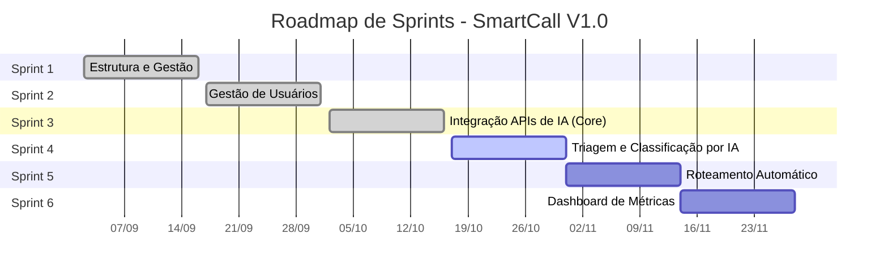

# 🌐 InfinityWare 2 – Inteligência em Soluções Digitais

Tecnologia, Inteligência Artificial e Automação para o futuro corporativo.

A **InfinityWare** nasceu para resolver os desafios da transformação digital, oferecendo soluções de inteligência corporativa que unem inovação, segurança e agilidade. Entre os principais obstáculos enfrentados no início, estavam a estruturação de repositórios, a criação de fluxos de versionamento e a definição de processos claros de trabalho. Essas dores foram superadas e hoje a empresa ajuda parceiros a não cometerem os mesmos erros.

## Documentação e Planejamento

* 📈 **Backlog de Produto:** 🔗 [Backlog do Projeto](https://github.com/4-SEMESTRE/Smartcall/blob/Master/Backlog.md)
* 📚 **Pasta de Documentação:** 🔗 [Documentação do Projeto](https://github.com/4-SEMESTRE/Smartcall)
* 📂 **Outros elementos obrigatórios:**
    * [Sprints](https://github.com/4-SEMESTRE/Smartcall/blob/Master/Sprints.md)
    * [Diagramas](https://github.com/4-SEMESTRE/Smartcall/tree/Master/Diagramas)

## Cronograma de Evolução

## Cronograma Visual de Evolução

O roadmap abaixo apresenta uma visão geral do planejamento de Sprints para a entrega da Versão 1.0 do SmartCall.

## Tecnologias Utilizadas

* Integrações com OpenAI, IBM Watson e Azure AI
* Desenvolvimento Web, Mobile e Desktop (C# & Python)
* Arquitetura escalável e segura (LGPD)

## Estrutura do Projeto

* **PagBus** → Sistema de pagamento inteligente para transporte público
* **SmartCall** → Plataforma de gestão de chamados com triagem por IA
* **Diagramas UML** → Casos de uso, classe, sequência, implantação
* **Vídeos de entregas** → Incrementos

## Equipe

| Nome | Papel | Foto | GitHub | LinkedIn |
| :--- | :--- | :---: | :--- | :--- |
| Cauã Carvalho | Product Owner | | [GitHub](https://github.com/Arcano06) | [Linkedin](https://www.linkedin.com/in/cauacarvalhodev/) |
| Junior Onorato | Scrum Master | | — | — |
| Caique Silva | Desenvolvedor | | — | — |

## Licença

© 2024 InfinityWare – Soluções Digitais.
Distribuído sob a licença MIT. Consulte o arquivo `LICENSE`.
